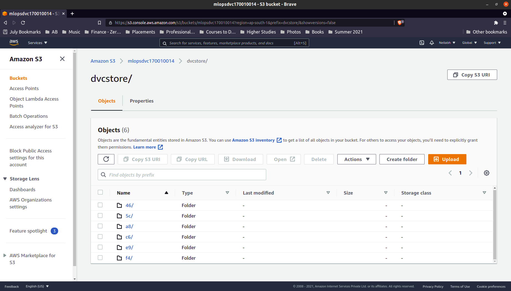

# Week 1
## Assignment 1
---
### Part I

[Link to ```MLOps_Assignment``` repo](https://github.com/Neilabh21/MLOps_Assignment)

---

```bash

  sudo apt install dvc

  git clone https://github.com/Neilabh21/MLOps_Assignment.git
  cd MLOps_Assignment/
  mkdir data

  dvc init

  dvc cache dir ~/Videos/Learner\'s\ Space\ 2021/external_cache/
  dvc add data/creditcard.csv

  git add data/creditcard.csv.dvc data/.gitignore
  git commit -m "Add raw data"
  git push

  sudo gedit ~/.bashrc
  source ~/.bashrc

  dvc remote add -d storage s3://mlopsdvc170010014/dvcstore
  git add .dvc/config
  git commit -m "Configure remote storage"
  git push

  dvc push
  git push origin main
```

---

Classifier | Accuracy | F1 Score
---------- | -------- | --------
Decision Tree | 0.9991397773954567 | 0.7586206896551724
Random Forest | 0.9995786664794073 | 0.8636363636363635

---




---

### Part II
